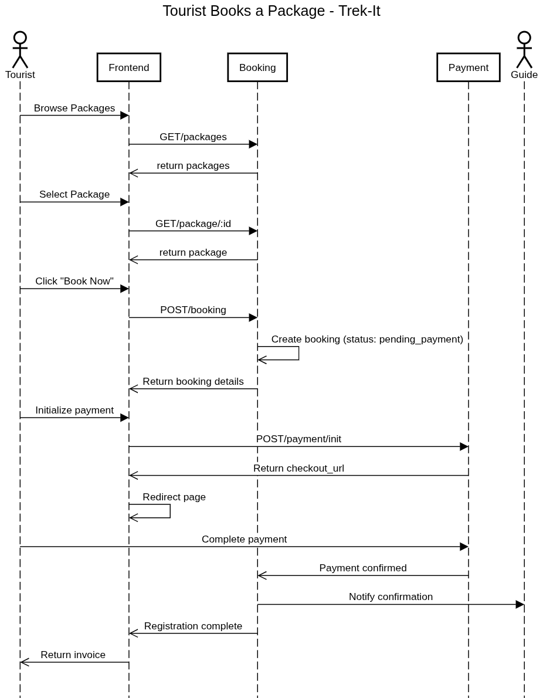
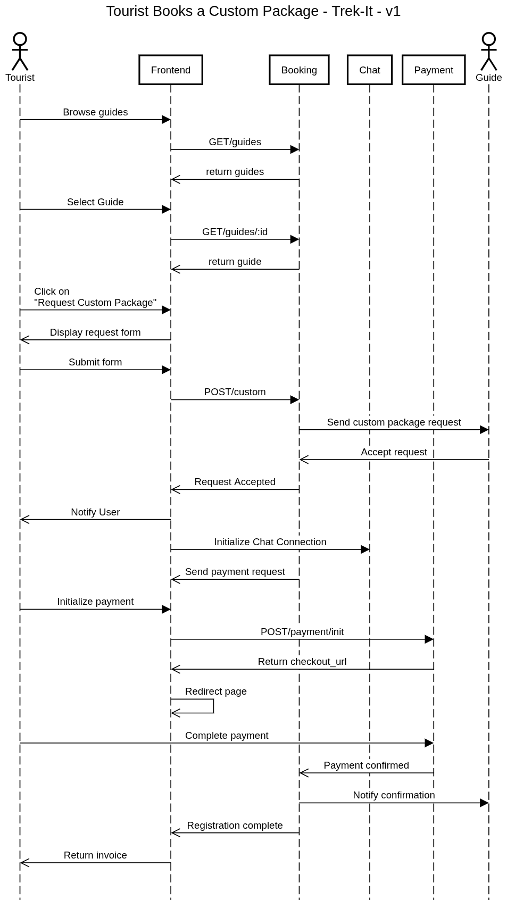
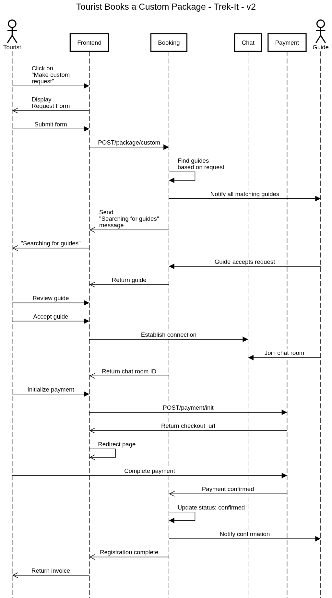
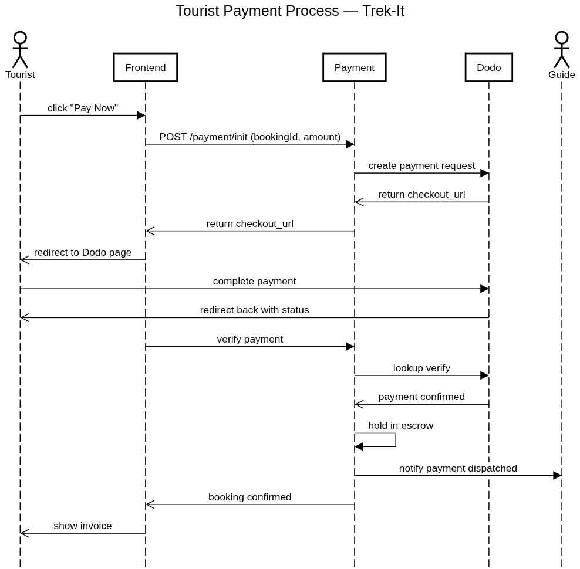
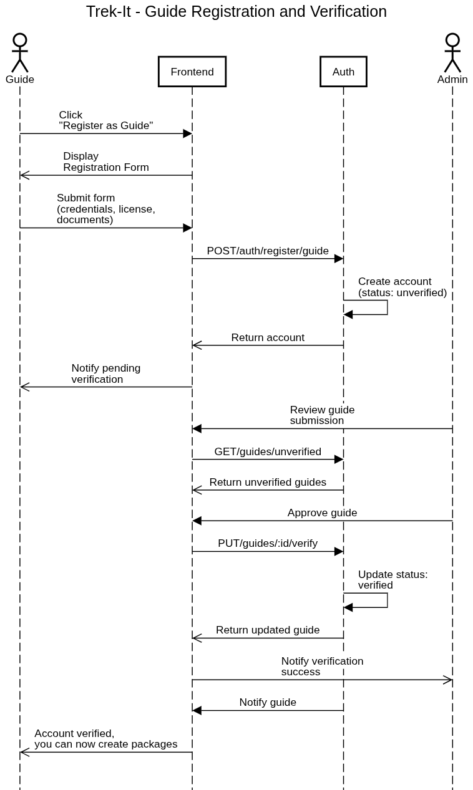
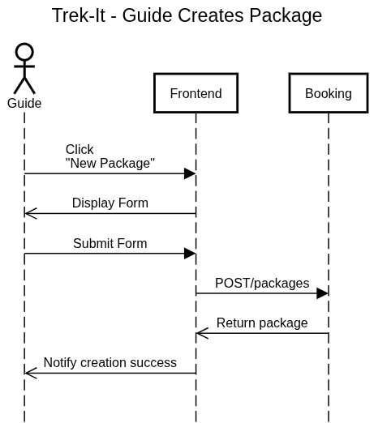

# Trek-it
> Search, Book, Customize. **Trek-it.**

Trek-It is a one stop guide booking system for flexible, custom and safety priority travels, focused in Nepal.
Trek-It makes it convenient to find a guide and design a custom itinerary with the guide of your selection.

**[Visit Us(will add link later)](https://www.loremipsum.com)**

# Features
Upon completion, trek-it is expected to provide the following features:
- Guide Booking
- Content-based recommendation
- Payment integrations with escrow
- Real-time encrypted chat service
- Package Creation from guide's side

# Sequence Diagrams
Tourist books a package

Tourist Requests a Custom package - version 1

Tourist Requests a Custom package - version 1

Tourist Payment Process

Guide gets verified

Guide creates a package

